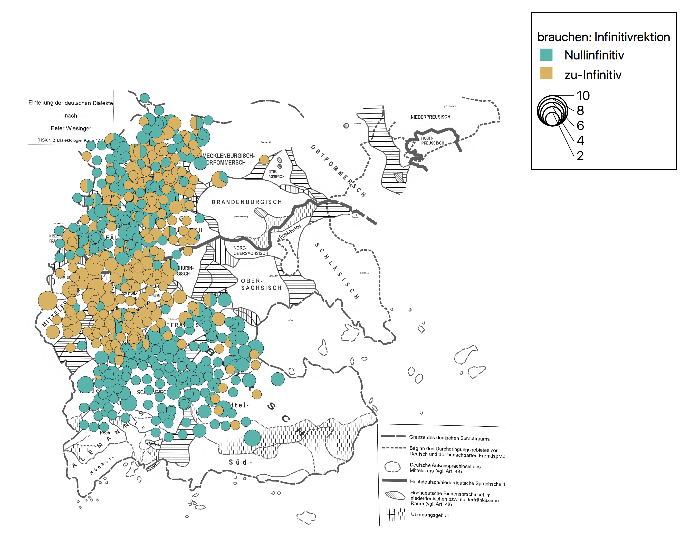
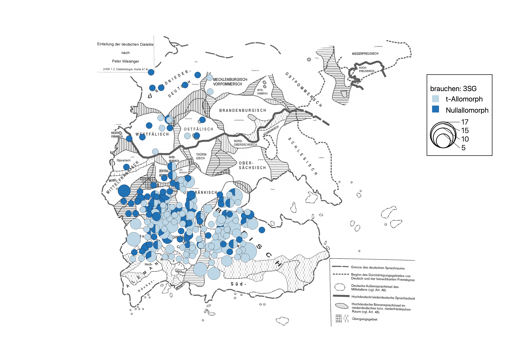

# Modal properties of _brauchen:_ An analysis of the Zwirner data

**Credits:** I want to thank my student assistant Tanja Milosevic for helping me annotate the data. 

### 1. Background

A well-known example for morphological class-convergence is the verb _brauchen_ ‘need’ that is becoming integrated into the paradigm of modals, i.e. preterite-present verbs (see Lenz 1997; Reis 2005 and Maché 2019: 176–220 for a detailed discussion). As with the other verbs of this class,[^1] it can govern a simple infinitive instead of the _zu_-infinitive (1). It also shows a morphologically-triggered loss of the _-t_-affix in the 3SG that seems to be missing with phonotactically similar verbs, as the contrast between (2a) and (2b) demonstrates. 

(1) Du brauchst nicht (zu) kommen.   
‘You needn’t come.’
	
(2a) Er brauch(t) nicht kommen.  
‘He needn’t come.’

(2b) * Er rauch nicht.   
‘He doesn’t smoke.’

Together with ə-apocope in the 1SG, which is typical in spoken German, this leads to the syncretism 1SG/3SG characteristic of modals,[^2] as illustrated in Table 1: 

| 1SG         | 3 SG        |
|-------------|-------------|
| _muss_      | _muss_      |
| _kann_      | _kann_      |
| _brauch(e)_ | _brauch(t)_ |
> Table 1: Typical modal syncretism of _brauchen_ in the 1/3SG

[^1]: A notable exception is the verb _wissen_ ‘know’ that selects a _zu_-marked infinitive in its modal uses. It is also the only modal predicate with obligatory subject control since _wollen_ ‘want’ and _möchten_ ‘like (to)’ display this type of orientation only in some uses (see Reis 2001: Sect. 3 and 312 for some discussion).

[^2]: Maitz and Tronka (2009) criticize a purely morphological explanation of this convergence, pointing to the observation that final _-t_ can indeed be phonologically deleted in certain contexts (e.g. _nich_ for _nicht_ ‘not’). This indicateas that apocope (of /ə/ or /t/) is a necessary, yet not sufficient condition for convergence. However, the areal patterns discussed below are irrefutable evidence that morphology plays a role, too.

Further modal properties of _brauchen_ are analogical Umlaut in the preterite subjunctive (3a), as can also be observed with the irregularized auxiliary _haben_ ‘have’ (Nübling 2001), and the substitute infinitive (_Infinitivus pro participio_), which is optional with this verb, see (3b), whereas it is obligatory with modals.

(3a) Dann _bräuchten_.SBJV wir uns nicht so zu beeilen.   
‘Then we wouldn’t need to rush.’  
(3b) Sie hätten nicht kommen _brauchen_ | gebraucht.  
‘They wouln’t have needed to come.’

Two other noteworthy properties of _brauchen_ that show its affinity to the modal class are the availability of epistemic interpretations (4a) and its restriction to negative polarity contexts (4b). A similar development occurred with _dürfen_: In MHG times, it is predominantly attested in negation contexts and only later became to be generalized (Bech 1951: 14; Maché 2019: 115). Especially in regional varieties of German (e.g. in North Rhine-Westphalia), non-NPI uses of _brauchen_ do show up (Maché 2019: 204–205).

(4a) Das braucht nicht (zu) stimmen.  
‘That needn’t be true.’  
(4b) Das brauchst du mir doch *(nicht) zu sagen!  
‘There is no need for you in telling me this.’  

In terms of areal diffusion, there is an astonishing complementarity between _t_-loss and presence/absence of _zu_: As the respective maps of the _Atlas zur deutschen Alltagssprache_ (AdA) and the _Atlas zur Aussprache des deutschen Gebrauchsstandards_ (AADG) show, _zu_-less infinitives predominantly occur in the southern parts of the German-speaking areas whereas _t_-less forms are a characteristic of central and northern varieties.[^3] Such areal patterns are characteristic of linguistic innovations and have been referred to as ‘layering’ in the literature on grammaticalization phenomena (Hopper 1991). An interesting apparent-time study on the development of _brauchen_ on a smaller scale is Girnth (2000), who focuses on West Central German dialects. 

[^3]: See AdA, Map 7/f06a ([https://www.atlas-alltagssprache.de/runde-7/f06a/](https://www.atlas-alltagssprache.de/runde-7/f06a/)) and AADG, /t/-elision with _braucht_ (3SG) ([http://prowiki.ids-mannheim.de/bin/view/AADG/BrauchtTSspr](http://prowiki.ids-mannheim.de/bin/view/AADG/BrauchtTSspr)) (last accessed on 16 June 2022).

### 2. Study on areal variation with _brauchen_

In the hope of obtaining a more detailed picture of this dimension of _brauchen_ in German, we made use of the Zwirner Corpus, a digitized collection of transcribed audio recordings compiled (and maintained) by the _Institut für Deutsche Sprache_ (IDS) in Mannheim (see Fiehler and Wagener 2005 for some background information about the make up of this corpus), which can be accessed online via the DGD platform.[^4] The original recordings as well as the transcripts stem from a big enquête that was conducted in the 1950s and 1960s under the supervision of Eberhard Zwirner (see Zwirner and Bethge 1958 and Bethge 1976 for some background information). This collection comprises ca. 5000 recordings from 1000 locations (Schmidt and Herrgen 2011: 118) in former West Germany (Federal Republic of Germany), covering all major dialect regions of German with a grid of 16km length. At each location, different age groups were usually included in the survey (speakers > 60 years of age, middle generation, younger speakers around the age of 20) (Zwirner and Bethge 1958: 16–17). Since we are only interested in the diatopic dimension, we will abstract away from this inherent multidimensionality.

[^4]: See [http://dgd.ids-mannheim.de/dgd/pragdb.dgd_extern.welcome](http://dgd.ids-mannheim.de/dgd/pragdb.dgd_extern.welcome) (last accessed on 16 June 2022). The acronym DGD stands for _Datenbank Gesprochenes Deutsch_ ‘database of spoken German’.

We extracted all relevant examples for _brauchen_ in both configurations, yielding the samples[^5] given in Table 2. Since all available transcripts use Standard German as reference, there is no risk of overlooking forms with idiosyncratic or unexpected phonological shapes. The DGD is tagged for POS and morphosyntactic information, which makes searching for the relevant forms easy. Due to tagging errors, some caution is warrented as regards the recall of our sample. What is more, faulty transcriptions need to be taken into consideration. Therefore, we manually double-checked all extracts with the original audio-recordings before annotating them for the factors ± _zu_-infinitive and ± _-t_ in the 3SG, respectively. These precautionary measures reduced the sample size considerably, yet it stills shows an exceptionally dense areal coverage. The fact that the coordinates of the respective locations are also included in the new release of the Zwirner corpus allowed us directly map our results with the open-source software QGIS.[^6]

| Phenomenon              | Sample size | Relevant examples |                     
|-------------------------|-------------|-------------------|
| form of the infinitive  | 2927        | 929               |
| 3SG                     | 914         | 362               |
> Table 2: Sample sizes

[^5]: We used the queries _brauchen_ (lemma) and _braucht_ (transcribed), respectively. Both samples can be accessed via the following IDs: aeo0my (infinitive); O4grsv (3SG).

[^6]: Available via the following URL: [https://www.qgis.org](https://www.qgis.org) (last accessed on 16 June 2022).

As indicated by Table 3, the simple infinitive is the dominant pattern when it comes to the government properties of _brauchen_. It goes without saying that the difference in proportion between the two infinitival forms is highly significant $(\chi^2 = 15.76, df = 1, p < .00001)$.

|                              | Total       |
|------------------------------|-------------|             
| _zu_-infinitive              | 404 (43.5%) |
| simple infinitive            | 525 (56.5%) | 
| Total             	       | **929**     |
> Table 3: Proportions of _zu_ vs. simple infinitives governed by _brauchen_

Turning to the areal profile of these variant (Map 1), _zu_-less infinitives governed by _brauchen_ are very prominent in Upper German. In the central German dialects, _zu_-marked infinitives predominante by contrast. In Low German, both variants occur side by side with no clear preference pattern. This picture corresponds to the empirical situation documented by the AdA, which is targeted at regional/colloquial varieties instead of base dialects. Importantly, in the northern dialects of our sample, _zu_ is much more prevalent than in the AdA-data.

> Map 1: Forms of the infinitive governed by _brauchen_ in German dialects

Let us now have a look at the morphological characteristics of the 3SG. Our sample contained 362 relevant examples; the proportions of the two allomorphs vs. modal and full verb uses are given in Table 4. In its modal uses (i.e. governing an infinitival complement) _t_-less forms are attested at a moderatly higher rate (~ 8%) than the ones exhibiting final _-t_. Full verb uses, by comparison, show a significantly larger rate of _t-_-forms, almost three times. It is obvious that difference in proportions of these allomorphs depending on verb use is highly significant $(z = 3.7292, p < 0.0001)$; the expected probabilities $(\hat{p})$ are $0.3628$ for $\varnothing$-forms and $0.1406$ for _t-_forms.[^7] The areal profile of both allomorphs is depicted in map 2 and 3.

|                 | Modal use  | Full verb use | Total  |
|-----------------|------------|---------------|--------|                
| _-t_            | 35 (46.1%) | 214 (74.8%)   | 249    |
| $$\varnothing$$ | 41 (53.9%) | 72 (25.2%)    | 113    |
| Total           | 76	       | 286           | **362**|
> Table 4: Proportions of the two allomorphs of the 3SG

[^7]: We used a one-sided hypothesis test, with the alternative hypothesis ($H_1$): proportion $\varnothing$-morph > proportion _t-_morph.

In diatopic terms, there seems to be no discernible areal skewing between allmorph type and full verb vs. modal uses of _brauchen_, i.e. there is no layering effect regarding the class convergence of this verb towards the modals (see Maps 2a and 2b). Conflating polysemy (full verb vs. modal) and focusing on the allmorphs alone, we can observe that _t_-forms predominate in the Upper German dialects. However, this difference is not as pronounced as in the AADG-map mentioned in Section 1. We believe that this contrast is at least partially caused by our empirical source. Whereas the AADG is based on elicitation data, the Zwirner corpus comprises continuous speech, making it hard to control for factors like coarticulation or other phonetic/phonological factors applying in this modality.

.png)
> Map 2a: Null-allomorph of the 3SG _braucht_ by verb class

.png)
> Map 2b: t-allomorph of the 3SG _braucht_ by verb class

> Map 3: Allomorphs of the 3SG _braucht_ in German dialects

### References

Bech, Gunnar (1951): Grundzüge der semantischen Entwicklungsgeschichte der hochdeutschen Modalverba. (Historisk-filologiske meddelelser; 32). Copenhagen: Munksgaard.

Bethge, Wolfgang (1976): Vom Werden und Wirken des Deutschen Spracharchivs. In: Zeitschrift für Dialektologie und Linguistik 43(1): 22–37.

Fiehler, Reinhard and Peter Wagener (2005): Die Datenbank Gesprochenes Deutsch (DGD) – Sammlung, Dokumentation, Archivierung und Untersuchung gesprochener Sprache als Aufgaben der Sprachwissenschaft. URL: [http://www.gespraechsforschung-ozs.de/heft2005/px-fiehler.pdf](http://www.gespraechsforschung-ozs.de/heft2005/px-fiehler.pdf) (last accessed: 1 June 2022).

Girnth, Heiko (2000): Untersuchungen zur Theorie der Grammatikalisierung am Beispiel des Westmitteldeutschen. (Reihe Germanistische Linguistik; 223). Tübingen: Niemeyer.

Nübling, Damaris (2001): The development of ‘junk’. irregularization strategies of _have_ and _say_ in the germanic languages. In: Geert Booij and Jaap van Marle (eds.): Yearbook of morphology 1999: 53–74. Dordrecht: Kluwer.

Hopper, Paul J. (1991): On some principles of grammaticalization. In Elizabeth C. Traugott and Bernd Heine (eds.): Approaches to grammaticalization. Vol. 1: Focus on theoretical and methodological issues: 17–35. (Typological Studies in Language; 19.1). Amsterdam, Philadelphia: Benjamins.

Lenz, Barbara (1997): Wie _brauchen_ ins deutsche Modalverbsystem geriet und welche Rolle es darin spielt. Beiträge zur Geschichte der deutschen Sprache und Literatur 118: 393–422.

Maitz, Péter and Krisztián Tronka (2009): _brauchen_ – Phonologische Aspekte der Auxiliarisierung. In: Zeitschrift für Dialektologie und Linguistik 76(2): 189–202.

Reis, Marga (2001): Bilden Modalverben im Deutschen eine syntaktische Klasse?”. In: Reimar Müller and Marga Reis (eds.): In: Modalität und Modalverben im Deutschen: 287–318. (Linguistische Berichte; Sonderheft 9). Hamburg: Buske.

—(2005): „Wer _brauchen_ ohne _zu_ gebraucht…“: Zu systemgerechten „Verstößen“ im Gegenwartsdeutschen. In: Cahier d’Études Germaniques 48(1): 101–114.

Schmidt, Jürgen Erich and Joachim Herrgen (2011): Sprachdynamik. Eine Einführung in die moderne Regionalsprachenforschung. (Grundlagen der Germanistik; 49). Berlin: Erich Schmidt Verlag.

Zwirner, Eberhard and Wolfgang Bethge (1958): Erläuterungen zu den Texten. Lautbibliothek der deutschen Mundarten; 1). Göttingen: Vandenhoeck & Ruprecht.

